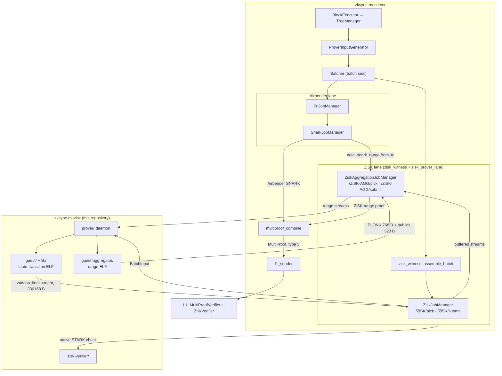

# The ZKsync OS multi-proof lane

One state transition, two independent provers: every batch is proven by
**Airbender** (the primary RV32I prover running the native ZKsync OS binary)
and by **ZiSK** (an RV64IMA zkVM running an independent REVM-based
re-implementation of the state transition), and L1 verification requires
both. A bug in either implementation, compiler, or proof system surfaces as
a proof mismatch instead of a silent state corruption.

The lane rolls out testnet-first on its way to production; every stage is
config-gated and off by default until enabled for a chain.

## The independence invariant

Both provers commit the same value:

```text
BatchPublicInput = keccak256(
    state_before ‖ state_after ‖ chain_config_hash ‖ batch_output_hash
)
```

The guest derives every field of that value in the zkVM, from the witness
alone, authenticated against the `tree_root_before` that L1 already holds.
No field arrives from Airbender, and no field is trusted from the server.
Agreement between the two provers is therefore evidence, not the source of
soundness.

Divergence fails closed. In the shadow modes the node halts. In the
required mode L1 rejects the batch.

The four committed fields come from:

- **`state_before`** — `Blake2s(tree_root, leaf_count, block_number,
  block_hashes_blake, timestamp)` over the batch-opening state.
- **`state_after`** — the same hash over the state the REVM execution and
  the tree update proof produce.
- **`chain_config_hash`** — the canonical commitment to the chain
  configuration.
- **`batch_output_hash`** — `Keccak256` over the chain id, the timestamps,
  the DA commitment, the transaction counts, the priority-operations hash,
  the L2 logs root, and the remaining batch outputs.

The guest proves each of these inside the zkVM:

- every storage read (each `SLOAD`) against a Blake2s merkle proof that
  recovers the expected state root,
- account balances and nonces against their preimage hashes,
- L2 transaction signatures with secp256k1 ecrecover,
- L1 transaction hash binding (`keccak256(encoded_tx) == l1_tx_hash`),
- bytecode integrity (`keccak256(code) == code_hash`),
- the block header hash from the execution results (RLP plus keccak256),
- the tree update entries against the REVM execution diffs.

## System flow



The Batcher opens the ZiSK job directly at batch seal, so the ZiSK lane runs
independently of the FRI lane and starts proving at the same moment.
`SnarkJobManager` tells the aggregation manager the exact batch range it
assigned (`note_snark_range`), so a ZiSK range always covers the same
batches as its Airbender SNARK.

## Repository map

| Repository | Role |
|---|---|
| `matter-labs/zksync-os-zisk` (this repo) | The ZiSK side end to end: the REVM re-implementation (`lib/`), the zkVM guest (`guest/`), the range aggregator guest (`guest-aggregator/`), the proving daemon (`prover/`), the off-chain verification helpers (`zisk-verifier/`), and the EEST conformance lane (`tools/`). |
| `matter-labs/zksync-os-revm` | The REVM extension crate the re-implementation executes on: ZKsync OS system-contract precompiles, L2→L1 log collection, spec gating. |
| `matter-labs/zksync-os-server` | Second-proof-system input generation (`zisk_witness`), the ZiSK job lane (`zisk_prover_lane`), shadow re-execution equivalence, off-chain proof verification, the multiproof rendezvous, and L1 submission. Tracked in matter-labs/zksync-os-server#1472. |
| `matter-labs/era-contracts` | `ZiskVerifier` (Plonk SNARK over the 320-byte public values), `MultiProofVerifier` (combined type-5 proof), aggregated range mode, deployment dispatch. Tracked in matter-labs/era-contracts#2305. |

## Components of this repository

**`lib/`** — the independent re-implementation of the ZKsync OS state
transition on REVM. This crate is the actual second prover: it executes the
batch, verifies every storage read against a Blake2s merkle proof, and
derives the batch commitment. It is backend-neutral and `no_std`-friendly,
so a third zkVM backend stays cheap. It compiles to RV64IMA for the guest
and to the host target for the server's shadow re-execution.

**`guest/`** — the ZiSK entry point around `lib/`: input framing, crypto
provider installation, and the 32-byte commit. It builds reproducibly inside
a pinned container. `guest/GUEST_ELF_SHA256` and `guest/GUEST_PROGRAM_VK`
record the pinned identity of the binary.

**`guest-aggregator/`** — in-zkVM recursion. It verifies N per-batch
`vadcop_final` proofs inside the zkVM and folds them into one range proof,
so one L1 verification covers a whole batch range.
`guest-aggregator/BINDING_VECTOR.md` holds the cross-stack test vector that
this guest, the server and the L1 tests all pin.

**`prover/`** — the proving daemon. It polls the server's job API, drives
the ZiSK toolchain over both ELFs, and submits the results. It has two
backends: one process per proof (the default) and a resident coordinator
that keeps the proving keys and the GPU loaded.

**`zisk-verifier/`** — the server's off-chain verification crate. It
reproduces the on-chain wire and key binding of a PLONK artifact, and it
runs a full native verification of a `vadcop_final` STARK stream.

**`tools/`** — development utilities: the EEST conformance lane, the
guest-memory benchmark, and the host-side input assemblers.

## Proof flow

The ZiSK lane mirrors Airbender's FRI-per-batch / SNARK-per-range split. Per
batch it produces a `vadcop_final` STARK. Per batch range it produces one
aggregated, Plonk-wrapped proof. The lane always aggregates: a range of one
batch takes the same path as a range of ten, so a single ZiSK verification
key covers every range width.

### Per batch

1. **Input generation** (server, `second_proof_system`): at batch seal, the
   server assembles a `BatchInput` — blocks, state reads, preimages and
   batch-boundary tree data — bincode-encoded next to the Airbender witness.
2. **ZiSK job** (server): a job per batch is served over
   `/prover-jobs/v1/ZiSK/*`. Proving starts immediately, in parallel with
   the Airbender FRI/SNARK lane.
3. **Proving** (this repo, `prover/`): the daemon fetches the input and
   runs the ZiSK toolchain over the guest ELF (GPU or CPU); the guest
   re-executes the batch on the `lib/` executor and commits the batch
   commitment in its publics. The run keeps the `vadcop_final` proof, and
   the daemon submits that stream with empty public values — the stream
   carries its own publics.
4. **Verification at submission** (server): the stream shape, the program-VK
   and vadcop-VK tripwires from the compiled release manifest for the batch's
   protocol version, the batch commitment, and the native STARK verification
   (`zisk-verifier`) all run before the server buffers the stream as range
   input.

### Per batch range

5. **Aggregation job** (server): the batch range of one Airbender SNARK
   doubles as the aggregation range, served over
   `/prover-jobs/v1/ZiSK-AGG/*` with the buffered per-batch streams. The
   pick is all-or-nothing, so a range never leaves the server until every
   per-batch stream in it exists.
6. **Range proving** (this repo, `prover/`): the aggregator guest verifies
   one inner proof per batch inside the zkVM and commits
   `keccak256(innerProgramVK ‖ rootCVadcopFinal ‖ chainedPI)`, where
   `chainedPI` is the self-seeded chain of batch commitments — exactly what
   the L1 range verifier recomputes from its own pins
   (`guest-aggregator/BINDING_VECTOR.md` pins a cross-stack test vector).
   The daemon wraps the range proof in Plonk and submits it.
7. **Rendezvous** (server): `multiproof_combine` composes the combined
   type-5 payload — Airbender SNARK plus ZiSK range proof — from whichever
   proof arrives last, and `l1_sender` submits it.
8. **L1** (era-contracts): `MultiProofVerifier` verifies the Airbender
   proof, and `ZiskVerifier` reconstructs the 320-byte ZiSK public values
   on-chain from its three pins and the batch public inputs, then verifies
   the ZiSK Plonk proof through a standalone snarkJS-generated verifier
   referenced by address.

## Wire formats

The server writes the current `BatchInput` wire v5. The guest reads the
leading version before the positional bincode payload and supports both the
released v3 schema and current v5 simultaneously; each is normalized into one
in-memory representation while preserving its `spec_id` and protocol minor.
Wire v3 can select AtlasV1 through AtlasV3, while wire v5 also carries the
AtlasV4-only chain-config mode and interop commitment-tree proofs. Wire v4 was
never released from `main` and is rejected. Supporting old input bytes does not
preserve the old programVK: any guest code change still produces a new ELF and
therefore rotates the key.

| Artifact | Size | Layout |
|---|---|---|
| Per-batch `vadcop_final` stream | 336168 B | `[minimal=0][n_publics=68][programVK(4)][publics(64)][body][vadcopVK(4)]`, u64 little-endian words |
| Plonk SNARK proof | 768 B | BN254 Plonk proof bytes |
| Public values | 320 B | `programVK (32) ‖ guest publics (256) ‖ rootCVadcopFinal (32)` |

The batch commitment sits at public-values bytes `[32..64]`. The publics
region is ziskos's full 64-word output area: the guest's 8 commitment words
first, zeros after. The single public signal the Plonk circuit proves is
`sha256(public_values) mod r`. The proof therefore carries no public values;
L1 reconstructs all 320 bytes from its own pins and the batch public inputs,
so the cross-proof binding is inherent.

## Keys and pinning

A `programVK` is the ROM merkle root of a guest ELF. It covers the ROM image
only, so two ELFs that differ outside the ROM image share it. Derive one on
a prover box with
`cargo-zisk program-setup -e <elf> -k ~/.zisk/provingKey`.

Four values identify the lane, and each is pinned at least twice so drift
is caught at the layer that notices first:

| Value | What it is | Pinned in |
|---|---|---|
| guest `programVK` | ROM merkle root of `out/zksync-os-zisk-guest` | `guest/GUEST_PROGRAM_VK`, server release manifest, L1 `ZiskVerifier.innerProgramVK()` |
| aggregator `programVK` | ROM merkle root of `out/zksync-os-zisk-guest-aggregator` | `guest-aggregator/GUEST_PROGRAM_VK`, server release manifest, L1 `ZiskVerifier.aggregatorProgramVK()` |
| `rootCVadcopFinal` | ZiSK vadcop-final circuit VK | server release manifest, L1 `ZiskVerifier.rootCVadcopFinal()`, binding digest |
| ZiSK VK hash | `keccak256` over the three pins above, in that order | server capability registry and startup check, L1 `ZiskVerifier.verificationKeyHash()` |

Current values, with ZiSK v0.18.0:

```text
guest ELF sha256      = 6c487fca080740f08346f95dc7f5b6db49127a8392744b23c233d19e81814a16
guest programVK       = pending derivation on a prover box (guest/GUEST_PROGRAM_VK)
aggregator ELF sha256 = f96f9285ca87083f322569d72fd379b67b1ee2ea3286c078c26e313acd27e7ae
aggregator programVK  = 0x4c3d7317a62f651d813ba6afbbce59e45eaa7c009ab2a9b51d2f0fb3e7987254
rootCVadcopFinal      = 0xcf2a309856f107b143836ada112806da71ae11567fa3f2d2050baba5381c7b7d
```

The programVKs derive from the exact ELF bytes, so guest binaries come from
pinned-container reproducible builds (`build-guest.sh`,
`build-aggregator.sh`; recorded hashes in `*/GUEST_ELF_SHA256`, checked in
CI). **The `lib/`, `guest/` and `guest-aggregator/` sources are byte-frozen
inputs of those builds** — any change there, including formatting, rotates
the programVKs. Rotations are deliberate: rebuild with `--record`, then run
the manually dispatched `Rotate program VK pins` workflow against that branch.
It re-derives both identities and opens a draft pin-update PR when required.
Update the server's versioned manifest, the L1 pins and the proof fixtures
together from the reviewed release manifest.

The server maps each protocol version to a compiled ZiSK proving release, so an
upgrade window where two versions coexist validates each batch against its own
manifest. Adding a version is a reviewed server binary change, like adding an
Airbender `ProvingVersion`; it is not an operator-local key override.

## Rollout ladder

The chain climbs one rung at a time. Every switch lives in the server's
`prover_input_generator` configuration.

| Rung | Configuration | What runs |
|---|---|---|
| Off (default) | `second_proof_system = false` | The server behaves byte for byte like upstream. The ZiSK crates stay inert. |
| Shadow execution | `zisk_shadow_execution = true` | Every sealed batch is re-executed on the CPU with the `lib/` executor, and the commitment is compared. No proving. |
| Shadow proving | `second_proof_system = true`, `multi_proof_verifier = false` | The daemon proves on the GPU and the server verifies the proofs. Airbender settles on L1 alone. |
| Multi-proof required | `multi_proof_verifier = true` | The server submits the combined type-5 payload. L1 requires both proofs. |

`halt_on_zisk_commitment_mismatch` selects the response to a divergence:
halt the node, or log and count it (`zisk_lane_commitment_mismatches`).

The EEST corpus lane (`tools/CORPUS.md`) is the third equivalence tooth. It
compares guest execution against native zksync-os over the Ethereum
execution-spec tests, off the critical path.

## Failure semantics

Sequencing is never gated by the second proof: block production and batch
sealing run ahead on both lanes, and proofs gate only L1 finality (the
generic sealing-ahead-of-finality backpressure applies unchanged).

On the top rung a batch that is missing its ZiSK proof stays queued and
re-offerable. `multi_proof_wait_timeout` sets when that wait escalates to a
loud error; the batch keeps its place in the queue, because the deployed
type-5-only verifier rejects an Airbender-only submission and would strand
the batch.

On the contract side, the strict `MultiProofVerifier` accepts only the
combined type-5 proof: with it as the chain's verifier, a missing second
proof halts finality — the load-bearing security property.
`MultiProofTestnetVerifier` composes the same verification with the testnet
escape hatches, so testnets keep finalizing while any real submission is
still held to the full multiproof.

## Component documentation

- Repository layout, reproducible builds, and development commands:
  repository `README.md`
- End-to-end bring-up on one machine: `E2E_SETUP.md`
- Proving daemon, its backends, its flags and its deployment:
  `prover/README.md`
- Aggregator binding digest and test vector: `guest-aggregator/BINDING_VECTOR.md`
- Off-chain proof verification the server runs before it submits:
  `zisk-verifier/src/lib.rs`
- Conformance corpus: `tools/CORPUS.md`
- L1 verifier generation and deployment: `era-contracts` →
  `l1-contracts/contracts/state-transition/verifiers/README.md`
